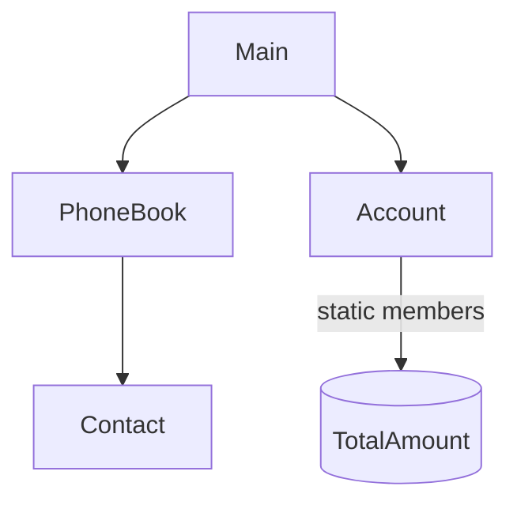

# 💻 C++ Modules (CPP00–CPP04) – 42

<!-- Section INTRO -->
## 🧭 Introducción
Los módulos de C++ en el cursus de **42** están diseñados para realizar una transición progresiva desde la programación estructurada en C hacia la **Programación Orientada a Objetos (POO)** con C++.

Durante los módulos **CPP00 → CPP04**, se exploran los conceptos fundamentales del lenguaje: encapsulación, herencia, polimorfismo, abstracción y gestión de memoria (**RAII**).  
Este bloque marca el inicio del pensamiento orientado a objetos y enseña a diseñar software modular, seguro y mantenible.

---

<!-- Section TOC -->
## 📚 Tabla de Contenidos
- [🧱 CPP00 – Fundamentos del lenguaje C++](#-cpp00--fundamentos-del-lenguaje-c)
- [⚙️ CPP01 – Memoria, punteros y referencias](#-cpp01--memoria-punteros-y-referencias)
- [🔢 CPP02 – Clases canónicas y operadores](#-cpp02--clases-canónicas-y-sobrecarga-de-operadores)
- [⚔️ CPP03 – Herencia y reutilización](#-cpp03--herencia-y-reutilización-de-clases)
- [🧬 CPP04 – Polimorfismo y abstracción](#-cpp04--polimorfismo-clases-abstractas-y-composición)
- [🧾 Conclusión General](#-conclusión-general)
- [📚 Recursos Recomendados](#-recursos-recomendados)

---

<!-- Section CPP00 -->
# 🧱 CPP00 – Fundamentos del lenguaje C++

## 🎯 Objetivo del módulo
Comprender las bases de C++: sintaxis, clases, objetos, métodos, encapsulación y la diferencia con C.  
El estudiante aprende a estructurar programas con clases y a usar la biblioteca estándar (`iostream`, `string`, etc.).

---

## 🧠 Conceptos teóricos clave
- **Clases y objetos:** modelo básico de la programación orientada a objetos.  
- **Encapsulación:** agrupar datos y funciones que los manipulan dentro de una misma entidad.  
- **Constructores y destructores:** creación y limpieza automática de objetos.  
- **Métodos:** funciones miembro que definen comportamientos de la clase.  
- **Entrada/salida con streams:** uso de `std::cin`, `std::cout`, `std::endl`.  
- **Namespaces y convenciones:** introducción a `std::` y al manejo de espacio de nombres.

---

## 🧩 Ejercicio ex00 – *Megaphone*

### 🎯 Objetivo
Familiarizarse con la sintaxis básica de C++, el uso de argumentos del `main`, y las funciones de la librería estándar.

### 💡 Descripción
El programa convierte a mayúsculas los argumentos pasados por línea de comandos y los muestra en la salida estándar.

```cpp
#include <iostream>
#include <cctype>

int main(int argc, char **argv) {
    if (argc == 1)
        std::cout << "* LOUD AND UNBEARABLE FEEDBACK NOISE *" << std::endl;
    else {
        for (int i = 1; i < argc; i++) {
            for (int j = 0; argv[i][j]; j++)
                std::cout << (char)std::toupper(argv[i][j]);
        }
        std::cout << std::endl;
    }
    return 0;
}
```

### 🧠 Conceptos aprendidos
- Manipulación de argumentos del programa (`argc`, `argv`).  
- Iteración con bucles anidados.  
- Uso de funciones de `<cctype>` (`toupper`).  
- E/S estándar con `std::cout`.

---

## 🧩 Ejercicio ex01 – *PhoneBook*

### 🎯 Objetivo
Diseñar una aplicación de consola básica que use **clases y objetos** para almacenar contactos.

### 💡 Descripción
El programa gestiona un repertorio telefónico con una clase `PhoneBook` que contiene una lista de `Contact`.  
Se introducen las nociones de **clases**, **atributos privados**, **métodos públicos**, y **constructores**.

```cpp
class Contact {
private:
    std::string name;
    std::string phone;
public:
    void setContact(std::string name, std::string phone);
    void display() const;
};
```

```cpp
class PhoneBook {
private:
    Contact contacts[8];
    int index;
public:
    PhoneBook();
    void addContact();
    void searchContact() const;
};
```

### 🧠 Conceptos aprendidos
- Encapsulación de datos (`private` y `public`).  
- Arrays de objetos.  
- Uso de clases y métodos.  
- Entrada de usuario (`std::getline`, `std::cin`).  
- Separación de lógica y datos.

### 💡 Aprendizaje
Se refuerza la idea de que los objetos pueden almacenar estado y ofrecer comportamientos asociados.

---

## 🧩 Ejercicio ex02 – *Account*

### 🎯 Objetivo
Introducir el concepto de **atributos estáticos** y **funciones miembro estáticas**.

### 💡 Descripción
Cada cuenta bancaria (`Account`) tiene sus propios valores (saldo, depósitos, etc.), pero también existen estadísticas globales compartidas por todas las cuentas (total de cuentas, total de dinero).

```cpp
class Account {
private:
    static int _nbAccounts;
    static int _totalAmount;
    int _accountIndex;
    int _amount;
public:
    Account(int initial_deposit);
    ~Account();
    void makeDeposit(int deposit);
    void makeWithdrawal(int withdrawal);
    static int getNbAccounts();
    static int getTotalAmount();
};
```

### 🧠 Conceptos aprendidos
- **Miembros estáticos:** valores compartidos entre todas las instancias.  
- **Alcance y contexto de clases.**  
- **Uso de `this` para referirse a la instancia actual.**  
- **Buenas prácticas de encapsulación.**

### 💡 Aprendizaje
Se entiende la diferencia entre datos **de instancia** (propios de un objeto) y datos **de clase** (compartidos por todos).

---

## 📊 Diagrama CPP00


---

## 🧾 Resumen CPP00

| Concepto | Descripción |
|-----------|-------------|
| Clases y objetos | Estructuras fundamentales del OOP |
| Métodos | Comportamientos definidos dentro de una clase |
| Encapsulación | Protección de los datos internos |
| Constructores/Destructores | Ciclo de vida automático de los objetos |
| Miembros estáticos | Datos compartidos entre instancias |
| Streams (`std::cout`, `std::cin`) | Entrada/salida de texto segura y moderna |

💡 **CPP00** sienta las bases de todo el aprendizaje de C++: desde la estructura básica de una clase hasta la interacción entre objetos y la manipulación de datos encapsulados.
