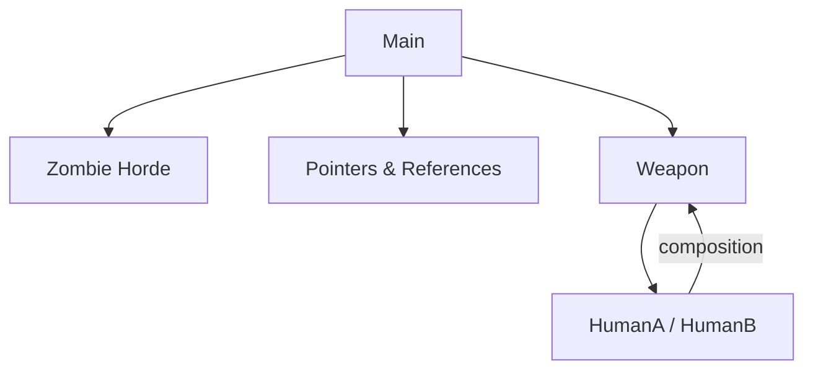

# 💻 C++ Modules (CPP00–CPP04) – 42

<!-- Section INTRO -->
## 🧭 Introducción
Los módulos de C++ en el cursus de **42** están diseñados para realizar una transición progresiva desde la programación estructurada en C hacia la **Programación Orientada a Objetos (POO)** con C++.

Durante los módulos **CPP00 → CPP04**, se exploran los conceptos fundamentales del lenguaje: encapsulación, herencia, polimorfismo, abstracción y gestión de memoria (**RAII**).  
Este bloque marca el inicio del pensamiento orientado a objetos y enseña a diseñar software modular, seguro y mantenible.

---

<!-- Section TOC -->
## 📚 Tabla de Contenidos
- [🧱 CPP00 – Fundamentos del lenguaje C++](#-cpp00--fundamentos-del-lenguaje-c)
- [⚙️ CPP01 – Memoria, punteros y referencias](#cpp01)
- [🔢 CPP02 – Clases canónicas y operadores](#-cpp02--clases-canónicas-y-sobrecarga-de-operadores)
- [⚔️ CPP03 – Herencia y reutilización](#-cpp03--herencia-y-reutilización-de-clases)
- [🧬 CPP04 – Polimorfismo y abstracción](#-cpp04--polimorfismo-clases-abstractas-y-composición)
- [🧾 Conclusión General](#-conclusión-general)
- [📚 Recursos Recomendados](#-recursos-recomendados)

---

<!-- Section CPP00 -->
# 🧱 CPP00 – Fundamentos del lenguaje C++

## 🎯 Objetivo del módulo
Comprender las bases de C++: sintaxis, clases, objetos, métodos, encapsulación y la diferencia con C.  
El estudiante aprende a estructurar programas con clases y a usar la biblioteca estándar (`iostream`, `string`, etc.).

---

## 🧠 Conceptos teóricos clave
- **Clases y objetos:** modelo básico de la programación orientada a objetos.  
- **Encapsulación:** agrupar datos y funciones que los manipulan dentro de una misma entidad.  
- **Constructores y destructores:** creación y limpieza automática de objetos.  
- **Métodos:** funciones miembro que definen comportamientos de la clase.  
- **Entrada/salida con streams:** uso de `std::cin`, `std::cout`, `std::endl`.  
- **Namespaces y convenciones:** introducción a `std::` y al manejo de espacio de nombres.

---

## 🧩 Ejercicio ex00 – *Megaphone*

### 🎯 Objetivo
Familiarizarse con la sintaxis básica de C++, el uso de argumentos del `main`, y las funciones de la librería estándar.

### 💡 Descripción
El programa convierte a mayúsculas los argumentos pasados por línea de comandos y los muestra en la salida estándar.

```cpp
#include <iostream>
#include <cctype>

int main(int argc, char **argv) {
    if (argc == 1)
        std::cout << "* LOUD AND UNBEARABLE FEEDBACK NOISE *" << std::endl;
    else {
        for (int i = 1; i < argc; i++) {
            for (int j = 0; argv[i][j]; j++)
                std::cout << (char)std::toupper(argv[i][j]);
        }
        std::cout << std::endl;
    }
    return 0;
}
```

### 🧠 Conceptos aprendidos
- Manipulación de argumentos del programa (`argc`, `argv`).  
- Iteración con bucles anidados.  
- Uso de funciones de `<cctype>` (`toupper`).  
- E/S estándar con `std::cout`.

---

## 🧩 Ejercicio ex01 – *PhoneBook*

### 🎯 Objetivo
Diseñar una aplicación de consola básica que use **clases y objetos** para almacenar contactos.

### 💡 Descripción
El programa gestiona un repertorio telefónico con una clase `PhoneBook` que contiene una lista de `Contact`.  
Se introducen las nociones de **clases**, **atributos privados**, **métodos públicos**, y **constructores**.

```cpp
class Contact {
private:
    std::string name;
    std::string phone;
public:
    void setContact(std::string name, std::string phone);
    void display() const;
};
```

```cpp
class PhoneBook {
private:
    Contact contacts[8];
    int index;
public:
    PhoneBook();
    void addContact();
    void searchContact() const;
};
```

### 🧠 Conceptos aprendidos
- Encapsulación de datos (`private` y `public`).  
- Arrays de objetos.  
- Uso de clases y métodos.  
- Entrada de usuario (`std::getline`, `std::cin`).  
- Separación de lógica y datos.

### 💡 Aprendizaje
Se refuerza la idea de que los objetos pueden almacenar estado y ofrecer comportamientos asociados.

---

## 🧩 Ejercicio ex02 – *Account*

### 🎯 Objetivo
Introducir el concepto de **atributos estáticos** y **funciones miembro estáticas**.

### 💡 Descripción
Cada cuenta bancaria (`Account`) tiene sus propios valores (saldo, depósitos, etc.), pero también existen estadísticas globales compartidas por todas las cuentas (total de cuentas, total de dinero).

```cpp
class Account {
private:
    static int _nbAccounts;
    static int _totalAmount;
    int _accountIndex;
    int _amount;
public:
    Account(int initial_deposit);
    ~Account();
    void makeDeposit(int deposit);
    void makeWithdrawal(int withdrawal);
    static int getNbAccounts();
    static int getTotalAmount();
};
```

### 🧠 Conceptos aprendidos
- **Miembros estáticos:** valores compartidos entre todas las instancias.  
- **Alcance y contexto de clases.**  
- **Uso de `this` para referirse a la instancia actual.**  
- **Buenas prácticas de encapsulación.**

### 💡 Aprendizaje
Se entiende la diferencia entre datos **de instancia** (propios de un objeto) y datos **de clase** (compartidos por todos).

---

## 📊 Diagrama CPP00
```
graph TD
    A[Main] --> B[PhoneBook]
    B --> C[Contact]
    A --> D[Account]
    D -->|static members| E[(TotalAmount)]
```

---

## 🧾 Resumen CPP00

| Concepto | Descripción |
|-----------|-------------|
| Clases y objetos | Estructuras fundamentales del OOP |
| Métodos | Comportamientos definidos dentro de una clase |
| Encapsulación | Protección de los datos internos |
| Constructores/Destructores | Ciclo de vida automático de los objetos |
| Miembros estáticos | Datos compartidos entre instancias |
| Streams (`std::cout`, `std::cin`) | Entrada/salida de texto segura y moderna |

💡 **CPP00** sienta las bases de todo el aprendizaje de C++: desde la estructura básica de una clase hasta la interacción entre objetos y la manipulación de datos encapsulados.

---

<!-- Section CPP01 -->
<span id="cpp01"></span>
# ⚙️ CPP01 – Memoria, punteros y referencias

## 🎯 Objetivo del módulo
Dominar la gestión de memoria en C++, entender la diferencia entre **stack** y **heap**, y aplicar el uso de **punteros**, **referencias** y **constructores**.  
También se introduce la composición de clases y la correcta gestión de recursos dinámicos.

---

## 🧠 Conceptos teóricos clave
- **Stack vs Heap:** memoria automática frente a memoria dinámica.
- **Operadores `new` y `delete`:** reserva y liberación manual de memoria.
- **Punteros (`*`) y referencias (`&`):** distintas formas de acceder a los datos.
- **Constructores y destructores:** inicialización y limpieza automática de objetos.
- **Composición:** una clase puede contener objetos de otras clases.
- **Const-correctness:** uso de `const` para evitar modificaciones accidentales.
- **Gestión de memoria segura:** evitar fugas y uso de punteros colgantes.

---

## 🧩 Ejercicio ex00 – *Zombie Horde*

### 🎯 Objetivo
Familiarizarse con la creación dinámica de objetos mediante `new[]` y su eliminación con `delete[]`.

### 💡 Descripción
El ejercicio consiste en crear una **horda de zombis** utilizando memoria dinámica.  
Cada zombi se genera con un nombre y anuncia su presencia al ser creado.

```cpp
Zombie* zombieHorde(int N, std::string name) {
    Zombie* horde = new Zombie[N];
    for (int i = 0; i < N; i++)
        horde[i].setName(name);
    return horde;
}
```

```cpp
int main() {
    Zombie* horde = zombieHorde(5, "Undead");
    for (int i = 0; i < 5; i++)
        horde[i].announce();
    delete[] horde;
}
```

### 🧠 Conceptos aprendidos
- Creación dinámica de arrays de objetos.
- Diferencia entre `new` / `delete` y `new[]` / `delete[]`.
- Gestión manual de memoria.
- Introducción a la composición de clases simples.

---

## 🧩 Ejercicio ex01 – *Memory Allocation*

### 🎯 Objetivo
Entender las diferencias entre variables automáticas (stack) y dinámicas (heap).

### 💡 Descripción
Se crean funciones que asignan memoria en ambos espacios y muestran la diferencia de ciclo de vida.

```cpp
void randomChump(std::string name) {
    Zombie z(name);
    z.announce(); // Vive solo dentro del stack
}

Zombie* newZombie(std::string name) {
    return new Zombie(name); // Vive en el heap
}
```

### 🧠 Conceptos aprendidos
- **Stack:** variables destruidas automáticamente al salir del ámbito.
- **Heap:** requiere `delete` explícito.
- **Scope:** determina la vida útil de las variables.
- **Buenas prácticas:** evitar fugas con `delete`.

---

## 🧩 Ejercicio ex02 – *Pointers and References*

### 🎯 Objetivo
Comprender la relación entre punteros, referencias y el objeto original.

### 💡 Descripción
Se trabaja con un string, un puntero y una referencia, imprimiendo sus direcciones de memoria y valores.

```cpp
std::string str = "HI THIS IS BRAIN";
std::string* stringPTR = &str;
std::string& stringREF = str;

std::cout << &str << std::endl;
std::cout << stringPTR << std::endl;
std::cout << &stringREF << std::endl;
```

### 🧠 Conceptos aprendidos
- **Punteros:** almacenan la dirección de memoria de una variable.
- **Referencias:** alias del objeto original (no pueden cambiar de objetivo).
- **Relación:** `*ptr` accede al valor, `&var` obtiene la dirección.
- **Uso práctico:** referencias para evitar copias costosas.

---

## 🧩 Ejercicio ex03 – *Weapon, HumanA, HumanB*

### 🎯 Objetivo
Aplicar la **composición de clases** y entender el uso de **referencias** frente a **punteros**.

### 💡 Descripción
Dos clases `HumanA` y `HumanB` usan un arma (`Weapon`) de diferente forma:
- `HumanA` tiene una **referencia**, el arma siempre existe.
- `HumanB` tiene un **puntero**, el arma puede cambiar o no existir.

```cpp
class Weapon {
private:
    std::string type;
public:
    const std::string& getType() const;
    void setType(std::string type);
};

class HumanA {
private:
    std::string name;
    Weapon& weapon;
public:
    HumanA(std::string name, Weapon& weapon);
    void attack() const;
};

class HumanB {
private:
    std::string name;
    Weapon* weapon;
public:
    HumanB(std::string name);
    void setWeapon(Weapon& weapon);
    void attack() const;
};
```

### 🧠 Conceptos aprendidos
- **Composición:** una clase contiene instancias de otra.
- **Referencias:** deben inicializarse, no pueden ser nulas.
- **Punteros:** pueden apuntar a `nullptr`.
- **Diseño flexible:** el tipo de relación cambia el comportamiento.

---

## 🧩 Ejercicio ex04 – *Sed is for losers*

### 🎯 Objetivo
Trabajar con **flujos de archivos (`ifstream`, `ofstream`)** y manipulación de texto.

### 💡 Descripción
El programa lee un archivo, reemplaza todas las ocurrencias de una palabra por otra y guarda el resultado.

```cpp
std::ifstream infile(filename);
std::ofstream outfile(filename + ".replace");

std::string line;
while (std::getline(infile, line)) {
    size_t pos = 0;
    while ((pos = line.find(s1, pos)) != std::string::npos) {
        line.erase(pos, s1.length());
        line.insert(pos, s2);
        pos += s2.length();
    }
    outfile << line << std::endl;
}
```

### 🧠 Conceptos aprendidos
- Manejo de archivos (`ifstream`, `ofstream`).
- Manipulación de strings (`find`, `erase`, `insert`).
- Buenas prácticas con flujos (cerrar archivos).
- Modularidad en funciones pequeñas.

---

## 📊 Diagrama CPP01


---

## 🧾 Resumen CPP01

| Concepto | Descripción |
|-----------|-------------|
| Stack / Heap | Diferencia entre memoria automática y dinámica |
| new / delete | Gestión manual de memoria |
| Punteros y referencias | Dos formas de acceder a objetos |
| Composición | Clases dentro de clases |
| ifstream / ofstream | Lectura y escritura de archivos |
| RAII | Gestión automática de recursos |

💡 **CPP01** refuerza el control sobre la memoria y enseña a diseñar clases seguras que gestionan correctamente sus recursos.

<!-- Section CPP02 -->
# 🔢 CPP02 – Clases canónicas y sobrecarga de operadores

## 🎯 Objetivo del módulo
Profundizar en el diseño de clases en C++, introduciendo los **constructores canónicos**, la **sobrecarga de operadores**, y el uso de **conversiones implícitas y explícitas**.  
Este módulo busca dominar la **gestión de copias** y la **semántica de valor**, fundamentales para escribir código C++ robusto y seguro.

---

## 🧠 Conceptos teóricos clave
- **Forma canónica de una clase:**  
  Cualquier clase debe definir correctamente su **constructor por defecto**, **constructor de copia**, **operador de asignación** y **destructor** si maneja recursos.
- **Regla de los tres (Rule of Three):**  
  Si una clase necesita uno de los tres (copia, asignación o destructor personalizado), probablemente necesita los tres.
- **Sobrecarga de operadores:**  
  Permite redefinir el comportamiento de operadores (`+`, `-`, `=`, `<<`, etc.) para tipos definidos por el usuario.
- **Conversión de tipos:**  
  Posibilidad de definir constructores o funciones de conversión para adaptar tipos (`int` a `Fixed`, etc.).
- **Encapsulación y coherencia de estado:**  
  Mantener siempre valores válidos dentro de la clase.

---

## 🧩 Ejercicio ex00 – *Fixed-point number (parte 1)*

### 🎯 Objetivo
Implementar una clase `Fixed` que represente números de punto fijo y aplicar los conceptos de **constructores** y **destructores**.

### 💡 Descripción
El primer ejercicio introduce una clase simple con un atributo privado `_rawBits` que almacena un valor entero.  
El objetivo es practicar el ciclo de vida completo de un objeto.

```cpp
class Fixed {
private:
    int _rawBits;
public:
    Fixed();
    Fixed(const Fixed& other);
    ~Fixed();
    Fixed& operator=(const Fixed& other);
    int getRawBits(void) const;
    void setRawBits(int const raw);
};
```

### 🧠 Conceptos aprendidos
- Ciclo de vida de objetos: creación, copia, asignación y destrucción.  
- Diferencias entre **copia superficial** y **profunda**.  
- Uso de `this` para acceder al contexto de la instancia.  
- Introducción al **canon de las cuatro funciones**.

---

## 🧩 Ejercicio ex01 – *Fixed-point number (parte 2)*

### 🎯 Objetivo
Agregar conversión entre **enteros**, **flotantes** y la representación de punto fijo.

### 💡 Descripción
La clase `Fixed` ahora puede construirse desde un `int` o un `float`, convirtiendo los valores a un formato de punto fijo.  
También se implementa `toInt()` y `toFloat()` para convertir en sentido inverso.

```cpp
class Fixed {
private:
    int _fixedPointValue;
    static const int _fractionalBits = 8;
public:
    Fixed();
    Fixed(const int value);
    Fixed(const float value);
    Fixed(const Fixed& other);
    ~Fixed();
    Fixed& operator=(const Fixed& other);

    float toFloat(void) const;
    int toInt(void) const;
};
```

Y la sobrecarga de operador de salida:
```cpp
std::ostream& operator<<(std::ostream& os, const Fixed& fixed);
```

### 🧠 Conceptos aprendidos
- Sobrecarga de constructores.  
- Conversiones implícitas entre tipos primitivos y objetos.  
- Sobrecarga del operador `<<` para imprimir objetos.  
- Constantes `static` dentro de la clase.  

---

## 🧩 Ejercicio ex02 – *Fixed-point number (parte 3)*

### 🎯 Objetivo
Implementar **operadores aritméticos y de comparación** en la clase `Fixed`.

### 💡 Descripción
Se añaden operadores como `>`, `<`, `>=`, `<=`, `==`, `!=`, `+`, `-`, `*`, `/` y operadores de incremento (`++`, `--`).

```cpp
bool operator>(const Fixed& other) const;
bool operator<(const Fixed& other) const;
Fixed operator+(const Fixed& other) const;
Fixed operator-(const Fixed& other) const;
Fixed operator*(const Fixed& other) const;
Fixed operator/(const Fixed& other) const;
Fixed& operator++();   // Pre-incremento
Fixed operator++(int); // Post-incremento
```

También se introducen las funciones estáticas:
```cpp
static Fixed& min(Fixed& a, Fixed& b);
static const Fixed& min(const Fixed& a, const Fixed& b);
static Fixed& max(Fixed& a, Fixed& b);
static const Fixed& max(const Fixed& a, const Fixed& b);
```

### 🧠 Conceptos aprendidos
- Sobrecarga de operadores aritméticos y de comparación.  
- Implementación de funciones estáticas.  
- Diferencia entre **pre** y **post** incremento.  
- Diseño orientado a expresividad (`a + b * c`).  
- Encadenamiento de operadores.  

---

## 🧩 Ejercicio ex03 – *Point class*

### 🎯 Objetivo
Combinar la clase `Fixed` en una nueva clase `Point` para representar coordenadas 2D inmutables.

### 💡 Descripción
Cada `Point` contiene dos objetos `Fixed` (`x` y `y`) y se implementa una función `bsp()` (*Binary Space Partitioning*) para determinar si un punto está dentro de un triángulo.

```cpp
class Point {
private:
    const Fixed _x;
    const Fixed _y;
public:
    Point();
    Point(const float x, const float y);
    Point(const Point& other);
    Point& operator=(const Point& other);
    ~Point();

    Fixed getX() const;
    Fixed getY() const;
};
```

La función `bsp()` aplica la fórmula del área para comprobar si un punto está dentro del triángulo:

```cpp
bool bsp(Point const a, Point const b, Point const c, Point const point);
```

### 🧠 Conceptos aprendidos
- **Composición de clases:** una clase utiliza otra.  
- **Inmutabilidad:** uso de `const` para garantizar objetos no modificables.  
- **Operaciones matemáticas con clases personalizadas.**  
- **Reutilización:** integración del trabajo anterior (`Fixed`).  

---

## 📊 Diagrama CPP02
```mermaid
graph TD
    A[Main] --> B[Fixed]
    B --> C[Operadores + - * /]
    B --> D[toInt / toFloat]
    A --> E[Point]
    E -->|usa| B
    E --> F[bsp() función externa]
```

---

## 🧾 Resumen CPP02

| Concepto | Descripción |
|-----------|-------------|
| Forma canónica | Conjunto de funciones básicas: constructor, copia, asignación, destructor |
| Rule of Three | Si una clase necesita uno, probablemente necesita los tres |
| Sobrecarga de operadores | Permite extender operadores para clases personalizadas |
| Conversión de tipos | Constructores y funciones de conversión (`toFloat`, `toInt`) |
| Inmutabilidad | Uso de `const` para proteger datos |
| Composición | Reutilización de clases previas (`Fixed` dentro de `Point`) |

💡 **CPP02** refuerza la comprensión profunda de la estructura de clases en C++, fomentando un estilo limpio, reutilizable y expresivo.

