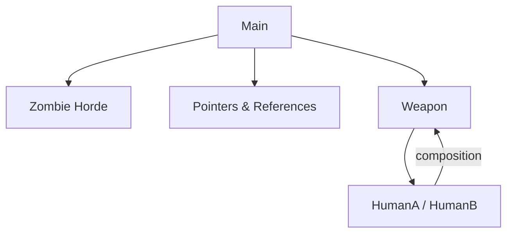

<!-- Section CPP01 -->
# ⚙️ CPP01 – Memoria, punteros y referencias

## 🎯 Objetivo del módulo
Dominar la gestión de memoria en C++, entender la diferencia entre **stack** y **heap**, y aplicar el uso de **punteros**, **referencias** y **constructores**.  
También se introduce la composición de clases y la correcta gestión de recursos dinámicos.

---

## 🧠 Conceptos teóricos clave
- **Stack vs Heap:** memoria automática frente a memoria dinámica.
- **Operadores `new` y `delete`:** reserva y liberación manual de memoria.
- **Punteros (`*`) y referencias (`&`):** distintas formas de acceder a los datos.
- **Constructores y destructores:** inicialización y limpieza automática de objetos.
- **Composición:** una clase puede contener objetos de otras clases.
- **Const-correctness:** uso de `const` para evitar modificaciones accidentales.
- **Gestión de memoria segura:** evitar fugas y uso de punteros colgantes.

---

## 🧩 Ejercicio ex00 – *Zombie Horde*

### 🎯 Objetivo
Familiarizarse con la creación dinámica de objetos mediante `new[]` y su eliminación con `delete[]`.

### 💡 Descripción
El ejercicio consiste en crear una **horda de zombis** utilizando memoria dinámica.  
Cada zombi se genera con un nombre y anuncia su presencia al ser creado.

```cpp
Zombie* zombieHorde(int N, std::string name) {
    Zombie* horde = new Zombie[N];
    for (int i = 0; i < N; i++)
        horde[i].setName(name);
    return horde;
}
```

```cpp
int main() {
    Zombie* horde = zombieHorde(5, "Undead");
    for (int i = 0; i < 5; i++)
        horde[i].announce();
    delete[] horde;
}
```

### 🧠 Conceptos aprendidos
- Creación dinámica de arrays de objetos.
- Diferencia entre `new` / `delete` y `new[]` / `delete[]`.
- Gestión manual de memoria.
- Introducción a la composición de clases simples.

---

## 🧩 Ejercicio ex01 – *Memory Allocation*

### 🎯 Objetivo
Entender las diferencias entre variables automáticas (stack) y dinámicas (heap).

### 💡 Descripción
Se crean funciones que asignan memoria en ambos espacios y muestran la diferencia de ciclo de vida.

```cpp
void randomChump(std::string name) {
    Zombie z(name);
    z.announce(); // Vive solo dentro del stack
}

Zombie* newZombie(std::string name) {
    return new Zombie(name); // Vive en el heap
}
```

### 🧠 Conceptos aprendidos
- **Stack:** variables destruidas automáticamente al salir del ámbito.
- **Heap:** requiere `delete` explícito.
- **Scope:** determina la vida útil de las variables.
- **Buenas prácticas:** evitar fugas con `delete`.

---

## 🧩 Ejercicio ex02 – *Pointers and References*

### 🎯 Objetivo
Comprender la relación entre punteros, referencias y el objeto original.

### 💡 Descripción
Se trabaja con un string, un puntero y una referencia, imprimiendo sus direcciones de memoria y valores.

```cpp
std::string str = "HI THIS IS BRAIN";
std::string* stringPTR = &str;
std::string& stringREF = str;

std::cout << &str << std::endl;
std::cout << stringPTR << std::endl;
std::cout << &stringREF << std::endl;
```

### 🧠 Conceptos aprendidos
- **Punteros:** almacenan la dirección de memoria de una variable.
- **Referencias:** alias del objeto original (no pueden cambiar de objetivo).
- **Relación:** `*ptr` accede al valor, `&var` obtiene la dirección.
- **Uso práctico:** referencias para evitar copias costosas.

---

## 🧩 Ejercicio ex03 – *Weapon, HumanA, HumanB*

### 🎯 Objetivo
Aplicar la **composición de clases** y entender el uso de **referencias** frente a **punteros**.

### 💡 Descripción
Dos clases `HumanA` y `HumanB` usan un arma (`Weapon`) de diferente forma:
- `HumanA` tiene una **referencia**, el arma siempre existe.
- `HumanB` tiene un **puntero**, el arma puede cambiar o no existir.

```cpp
class Weapon {
private:
    std::string type;
public:
    const std::string& getType() const;
    void setType(std::string type);
};

class HumanA {
private:
    std::string name;
    Weapon& weapon;
public:
    HumanA(std::string name, Weapon& weapon);
    void attack() const;
};

class HumanB {
private:
    std::string name;
    Weapon* weapon;
public:
    HumanB(std::string name);
    void setWeapon(Weapon& weapon);
    void attack() const;
};
```

### 🧠 Conceptos aprendidos
- **Composición:** una clase contiene instancias de otra.
- **Referencias:** deben inicializarse, no pueden ser nulas.
- **Punteros:** pueden apuntar a `nullptr`.
- **Diseño flexible:** el tipo de relación cambia el comportamiento.

---

## 🧩 Ejercicio ex04 – *Sed is for losers*

### 🎯 Objetivo
Trabajar con **flujos de archivos (`ifstream`, `ofstream`)** y manipulación de texto.

### 💡 Descripción
El programa lee un archivo, reemplaza todas las ocurrencias de una palabra por otra y guarda el resultado.

```cpp
std::ifstream infile(filename);
std::ofstream outfile(filename + ".replace");

std::string line;
while (std::getline(infile, line)) {
    size_t pos = 0;
    while ((pos = line.find(s1, pos)) != std::string::npos) {
        line.erase(pos, s1.length());
        line.insert(pos, s2);
        pos += s2.length();
    }
    outfile << line << std::endl;
}
```

### 🧠 Conceptos aprendidos
- Manejo de archivos (`ifstream`, `ofstream`).
- Manipulación de strings (`find`, `erase`, `insert`).
- Buenas prácticas con flujos (cerrar archivos).
- Modularidad en funciones pequeñas.

---

## 📊 Diagrama CPP01


---

## 🧾 Resumen CPP01

| Concepto | Descripción |
|-----------|-------------|
| Stack / Heap | Diferencia entre memoria automática y dinámica |
| new / delete | Gestión manual de memoria |
| Punteros y referencias | Dos formas de acceder a objetos |
| Composición | Clases dentro de clases |
| ifstream / ofstream | Lectura y escritura de archivos |
| RAII | Gestión automática de recursos |

💡 **CPP01** refuerza el control sobre la memoria y enseña a diseñar clases seguras que gestionan correctamente sus recursos.
