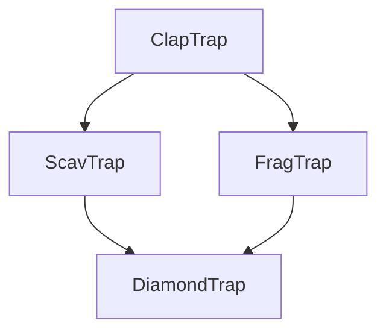

# ⚔️ CPP03 – Herencia y reutilización de clases
<span id="cpp03"></span>

## 🧭 Introducción
El módulo **CPP03** introduce uno de los pilares más importantes de la **Programación Orientada a Objetos (POO)**: la **herencia**.  
A través de la reutilización de código y la extensión de clases, se busca construir jerarquías que permitan especializar comportamientos sin duplicar lógica.

Este módulo profundiza en conceptos como:
- **Herencia simple** y **múltiple**.
- Uso del modificador `protected`.
- Constructores y destructores en clases derivadas.
- Sobrescritura de funciones (`override`).
- Problemas de ambigüedad y resolución mediante herencia **virtual**.

---

## 🧠 Conceptos teóricos clave

| Concepto | Descripción |
|-----------|-------------|
| **Herencia** | Mecanismo que permite crear nuevas clases basadas en otras existentes, reutilizando sus atributos y métodos. |
| **Clase base / derivada** | La clase base define los comportamientos comunes; las derivadas los extienden o modifican. |
| **Modificador `protected`** | Permite acceso a los miembros desde las clases derivadas, pero no desde el exterior. |
| **Constructores y destructores en herencia** | Se ejecutan en orden jerárquico: primero los de la base, luego los de la derivada. |
| **Sobrescritura (`virtual`)** | Permite redefinir métodos de la clase base manteniendo la misma interfaz. |
| **Herencia múltiple** | Una clase puede heredar de varias bases; puede generar ambigüedad, resuelta con `virtual`. |

---

## 🧩 Ejercicio ex00 – *ClapTrap*

### 🎯 Objetivo
Crear una clase base que sirva como plantilla para personajes que puedan atacar, recibir daño y repararse.

### 💡 Descripción
Se define la clase `ClapTrap` con atributos básicos: nombre, puntos de vida, energía y daño.

```cpp
class ClapTrap {
protected:
    std::string _name;
    int _hitPoints;
    int _energyPoints;
    int _attackDamage;

public:
    ClapTrap(std::string name);
    ~ClapTrap();
    void attack(const std::string& target);
    void takeDamage(unsigned int amount);
    void beRepaired(unsigned int amount);
};
```

### 🧠 Conceptos aprendidos
- Creación de una clase base reutilizable.  
- Encapsulación de atributos protegidos (`protected`).  
- Implementación de funciones miembro comunes.  
- Gestión del ciclo de vida del objeto con constructores y destructores.

---

## 🧩 Ejercicio ex01 – *ScavTrap*

### 🎯 Objetivo
Implementar una clase derivada que amplíe el comportamiento de `ClapTrap`.

### 💡 Descripción
`ScavTrap` hereda de `ClapTrap` y añade una nueva habilidad: **modo guardián**.

```cpp
class ScavTrap : public ClapTrap {
public:
    ScavTrap(std::string name);
    ~ScavTrap();
    void guardGate();
    void attack(const std::string& target); // Sobrescritura
};
```

```cpp
void ScavTrap::attack(const std::string& target) {
    if (_energyPoints > 0 && _hitPoints > 0) {
        std::cout << "ScavTrap " << _name << " slashes " << target
                  << " causing " << _attackDamage << " damage!" << std::endl;
        _energyPoints--;
    }
}
```

### 🧠 Conceptos aprendidos
- Herencia simple con `public`.
- Reutilización de constructores de la clase base.
- Sobrescritura de métodos heredados.
- Ampliación de funcionalidad sin modificar la base.

---

## 🧩 Ejercicio ex02 – *FragTrap*

### 🎯 Objetivo
Introducir otra clase derivada con características propias y reforzar la idea de jerarquía de herencia.

### 💡 Descripción
`FragTrap` hereda de `ClapTrap` e introduce la habilidad especial `highFivesGuys()`.

```cpp
class FragTrap : public ClapTrap {
public:
    FragTrap(std::string name);
    ~FragTrap();
    void highFivesGuys(void);
};
```

```cpp
void FragTrap::highFivesGuys(void) {
    std::cout << "FragTrap " << _name << " requests a high five! 🙌" << std::endl;
}
```

### 🧠 Conceptos aprendidos
- Extensión jerárquica de una clase base común.
- Diferencias de comportamiento entre clases derivadas.
- Organización de clases en árbol de herencia.

---

## 🧩 Ejercicio ex03 – *DiamondTrap*

### 🎯 Objetivo
Introducir la **herencia múltiple** y comprender los conflictos derivados de ella.

### 💡 Descripción
`DiamondTrap` hereda de **ScavTrap** y **FragTrap**, que a su vez heredan de **ClapTrap**, generando un **"problema del diamante"**.

```cpp
class DiamondTrap : public ScavTrap, public FragTrap {
private:
    std::string _name;

public:
    DiamondTrap(std::string name);
    ~DiamondTrap();
    void whoAmI();
};
```

```cpp
DiamondTrap::DiamondTrap(std::string name)
    : ClapTrap(name + "_clap_name"), ScavTrap(name), FragTrap(name), _name(name) {
    _hitPoints = FragTrap::_hitPoints;
    _energyPoints = ScavTrap::_energyPoints;
    _attackDamage = FragTrap::_attackDamage;
}
```

### 🧠 Conceptos aprendidos
- **Herencia múltiple:** una clase puede heredar de más de una clase base.
- **Ambigüedad:** se heredan múltiples copias de la misma clase base.
- **Solución:** herencia **virtual** en la clase base para compartir una única instancia.

```cpp
class ClapTrap {
protected:
    std::string _name;
public:
    ClapTrap(std::string name);
    virtual ~ClapTrap();
};
```

```cpp
class ScavTrap : virtual public ClapTrap { ... };
class FragTrap : virtual public ClapTrap { ... };
```

---

## 📊 Diagrama CPP03



---

## 🧩 Sección extra – Herencia múltiple y virtual

### 💡 El problema del diamante
Cuando una clase hereda de dos clases que a su vez heredan de una misma base, se crean **dos copias** de la clase base.  
Esto genera ambigüedad al acceder a sus miembros.

Ejemplo:
```cpp
class Base { public: int x; };
class A : public Base {};
class B : public Base {};
class C : public A, public B {}; // Error: Base duplicada
```

### ✅ Solución
Usar **herencia virtual**:
```cpp
class A : virtual public Base {};
class B : virtual public Base {};
class C : public A, public B {}; // Ahora Base es única
```

### 🔍 Consecuencias
- Los constructores de clases virtuales se llaman **una sola vez**.
- El orden de inicialización es más complejo, pero evita duplicaciones.
- Es común en jerarquías donde las subclases comparten una base común.

---

## 🧾 Resumen CPP03

| Concepto | Descripción |
|-----------|-------------|
| Herencia simple | Extensión de una clase base |
| Herencia múltiple | Una clase hereda de varias bases |
| `protected` | Acceso controlado a miembros |
| `virtual` | Permite sobrescritura polimórfica |
| Problema del diamante | Duplicación de la clase base |
| Herencia virtual | Soluciona la duplicación compartiendo la base |

💡 **CPP03** enseña cómo organizar jerarquías de clases efectivas, aprovechar la herencia para reducir redundancia y preparar la base para el **polimorfismo dinámico**, que se desarrolla en el siguiente módulo **CPP04**.
